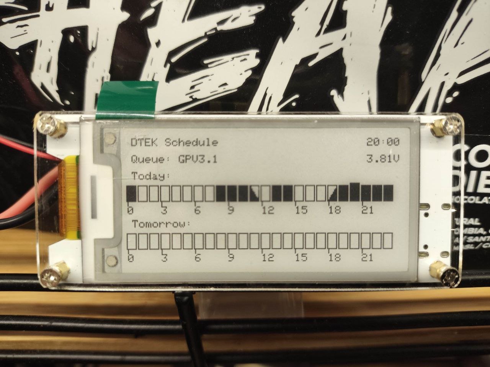

# DTEK Schedule Display

Server + Heltec Wireless Paper (ESP32) client for displaying [DTEK](https://www.dtek-dnem.com.ua/ua/shutdowns) electricity shutdown schedules on e-ink display.



## Overview

This is 95% AI-generated, so be careful. Basic functionality works and tested, but expect bugs

This project consists of two components:
- **Server**: Python API that scrapes DTEK schedules and serves them in a simple JSON format
- **Client**: ESP32-based e-ink display that fetches and displays the schedule

## ESP32 Client

The client runs on Heltec Wireless Paper boards and displays the electricity schedule on an e-ink screen. It shows today's and tomorrow's schedules with visual indicators for power status.

### Features
- Deep sleep mode for battery efficiency (wakes up every hour)
- Visual schedule display with hour blocks
- Battery voltage monitoring
- NTP time synchronization

### Hardware Requirements
- Heltec Wireless Paper V1.2 (or compatible versions)
- WiFi network access

### Configuration
Edit `client/main.ino` and update:
```cpp
#define WIFI_SSID "your-wifi-ssid"
#define PASSWORD "your-wifi-password"
#define API_URL "https://your-server.com/schedule/simple?password=your-password&queue=GPV3.1&days=2"
```

### Installation
1. Install Arduino IDE with ESP32 board support
2. Install required libraries:
   - [heltec-eink-modules](https://github.com/todd-herbert/heltec-eink-modules)
   - ArduinoJson
   - HTTPClient (included with ESP32)
3. Select your board version in the code (line 9)
4. Upload to your Heltec Wireless Paper board

## Server Deployment

The Python API server scrapes and serves DTEK schedules.

### Docker Deployment

```bash
cd server
docker-compose up -d
```

See server/Dockerfile and server/docker-compose.yml

### Native Linux Deployment

Below are quick steps to deploy it on Ubuntu.

### 1) Install system dependencies

```bash
sudo apt update
sudo apt install -y git python3 python3-venv python3-pip chromium-browser chromium-driver
```

Notes:
- If `chromium-browser` is unavailable, try `sudo apt install -y chromium` instead.
- The app uses undetected-chromedriver and Selenium; a Chromium/Chrome browser must be present.

### 2) Clone the repository

```bash
cd ~
git clone https://github.com/GriwMF/dtek-display
cd dtek-display/server
```

### 3) Create virtualenv and install Python deps

```bash
python3 -m venv venv
source venv/bin/activate
pip install -r requirements.txt
```

### 4) Test run (foreground)

```bash
./run_prod.sh
# Server listens on 0.0.0.0:5000
# Health check:  curl http://127.0.0.1:5000/health
```

Stop with Ctrl+C when you’re ready to install as a service.

### 5) Install as a systemd service (autostart)

Edit `server/dtek-schedule.service` and update these fields for your system:
- `User=` to your Linux username
- `WorkingDirectory=` to the absolute path of `.../dtek-display/server`
- `Environment="PATH=..."` to `.../dtek-display/server/venv/bin`
- `Environment="API_PASSWORD=..."` to your chosen password (or omit if set via environment)
- `ExecStart=` to point at `.../dtek-display/server/venv/bin/gunicorn ... server:app`

Then install and start:
```bash
./autostart.sh
```

Useful commands:
```bash
sudo systemctl status dtek-schedule
sudo journalctl -u dtek-schedule -f
sudo systemctl restart dtek-schedule
```

### 6) (Optional) Expose via Nginx

For internet exposure, put Nginx in front and proxy to `127.0.0.1:5000`. See `server/PRODUCTION.md` for a ready-to-use Nginx example and HTTPS with Let’s Encrypt.

### 7) API Endpoints

- `GET /health` — service health check
- `GET /schedule/simple?password=...&queue=GPV3.1&days=2` — returns simplified JSON for ESP32 client
- `GET /schedule?password=...&queue=GPV3.1&days=2` — returns full schedule data

Response format for `/schedule/simple`:
```json
{
  "q": "GPV3.1",
  "d": [
    [1,1,0,0,2,3,1,1,1,1,1,1,0,0,0,0,1,1,1,1,1,1,1,1],  // Today (24 hours)
    [0,0,0,0,1,1,1,1,1,1,1,1,0,0,0,0,1,1,1,1,1,1,1,1]   // Tomorrow
  ]
}
```
Status codes: 0=no power, 1=power on, 2=first half off, 3=second half off

For more details, see `server/README.md` and `server/PRODUCTION.md`.
